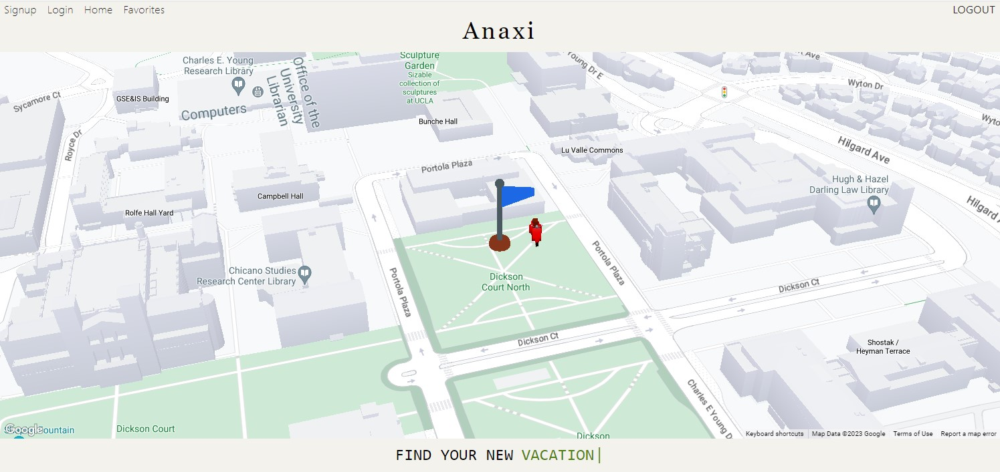

# Anaxi Mapper 🗺️

  [](https://opensource.org/licenses/MIT)

  🗺️ ```Anaxi Mapper```, or ```Anaxi``` for short, is a web application utilizing Google's map and WebGL map API's to provide an interactive, 3d user experience. 🗺️
  
  Users can navigate to addresses or cities and create search parameters to locate places of interest nearby, which will generate an overlay of 3d models and markers for ease of viewing! From there, users can also comment on and/or favorite their search results to share with others or simply review again in future visits!

  

  ## Site Link 💡

  [anaxi.app](https://www.anaxi.app)

  ## Table of Contents 📃

  [Usage 🤔](#usage-🤔)

  [Technologies Used ⚙️](#technologies-used-⚙️)

  [Local Installation 🖥️](#local-installation-🖥️)

  [Contribution Guidelines 🤝](#contribution-guidelines-🤝)

  [Developer Roadmap 🛣️](#developer-roadmap-🛣️)

  [Developers 🤓🤓🤓🤓](#developers-🤓🤓🤓🤓)

  [Acknowledgements 👨‍💻👨‍💻](#acknowledgements-👨‍💻👨‍💻)

  [Credits 🪙](#credits-🪙)

  ## Usage 🤔

  First time users need to sign up with an account to access the application; existing users may login using their credentials from the login page. 
  
  A default location and overlay will appear on the map. Under the map, there are two rows of search bars. The upper search bar is an address or city search, which will navigate the map to the desired location ✈️. The lower 3 search bars are a set of parameters for the nearby search, with the parameters being radius (in km), type (restaurants, gyms, etc), and keyword (eg. type: restaurant, keyword: sushi ). Once a nearby search is submitted in the desired starting address, the map will rerender with a new overlay containing markers and information on locations fulfilling the search parameters 📍! Under the search section, there is a list display of these locations as well, where users can add comments and favorite these results ❤️. To revisit past favorites, users can use the favorites list on the bottom right, which will hold all of the favorites saved onto their account.

  ## Technologies Used ⚙️

  Frontend: Typescript, Vite, ReactJS, TailwindCSS, Jotai, Threejs

  Backend: Javascript, MongoDB, Mongoose ODM, Express, Node, JWT, REST Api

  Other: Heroku, Google Maps Platform (Maps JS, Geocoding, Places, WebGL Overlay)

  ## Local Installation 🖥️

  To run this application locally, first clone this repository.

  Then, install the necessary dependencies.

    npm i

  Add a .env file in ```client``` with your credentials.

    VITE_APIKEY=<your-api-key>

  Add a .env file in ```server``` with your credentials.

    apiKey=<your-api-key>

  Navigate to this repository's root directory and run the following to start the application.

    npm run develop

  Your server will be hosted at ```http://localhost:5173```.

  Note: This application utilizes a MongoDB database. You will need to install MongoDB to run this application locally.

  ## Contribution Guidelines 🤝

  Contributors can submit changes by a new branch and creating a pull request. A pull request must have at least 1 approval before it can be merged into the main branch.

  To request contributor status, please contact one of the creators below:

  ## Developer Roadmap 🛣️

  - Routing Matrix

  - Travel Animations

  - User QOL improvements

  ## Developers 🤓🤓🤓🤓

  Brandon Ly 🫠 : [Github](https://github.com/brandonkylely) & [LinkedIn](https://www.linkedin.com/in/brandon-ly-7300b1205/) & [Email](mailto:brandonkly@ucla.edu)

  Logan Senn 😎 : [Github](https://github.com/lsenn404) & [LinkedIn](https://www.linkedin.com/in/logansenn/) & [Email](mailto:logsenn2@gmail.com)

  Mirjana Dukic 🥹 : [Github](https://github.com/mjdukic) & [LinkedIn](https://www.linkedin.com/in/mirjanadukic/) & [Email](mailto:mirjanadukicc@gmail.com)

  Hannah Kim 🥰 : [Github](https://github.com/hannahsykim) & [LinkedIn](https://www.linkedin.com/in/kimhannah1/) & [Email](mailto:hanhannah839@gmail.com)

  ### About

  This project was the product of 4 highly ambitious and creative full stack developers to showcase our ability to develop stunning web applications. Feel free to email us with any questions, suggestions, or business inquiries!

  ## Acknowledgements 👨‍💻👨‍💻

  ❤️ Special thanks to our mentors ❤️

  Chad Tao : [Github](https://github.com/chadtao206)

  Nick Graffis : [Github](https://github.com/nickgraffis)

  ## Credits 🪙

   [Low Poly Scooter](https://sketchfab.com/3d-models/low-poly-scooter-cf0b53fddb5c469b9d0259104151f72d) by [Qbo2Qbo](https://sketchfab.com/Qbo2Qbo) licensed under CC-BY-4.0 (http://creativecommons.org/licenses/by/4.0/)

  [Flag](https://market.pmnd.rs/) from [Kay Lousberg](https://market.pmnd.rs/creator/kaykit) at [PMNDRS Market](https://market.pmnd.rs/)